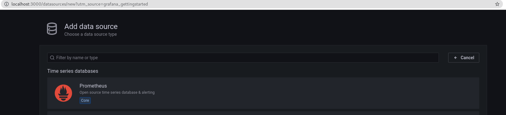
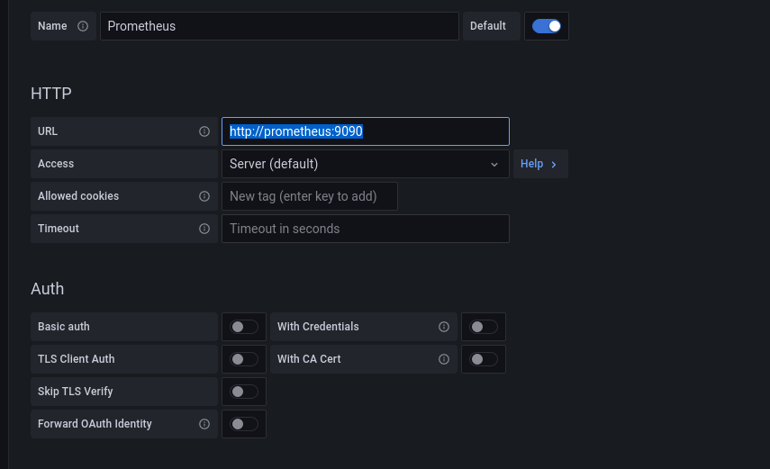
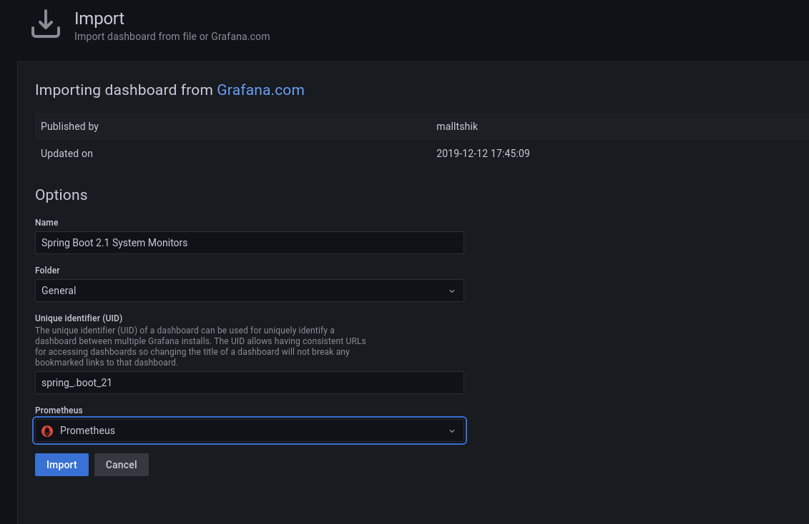
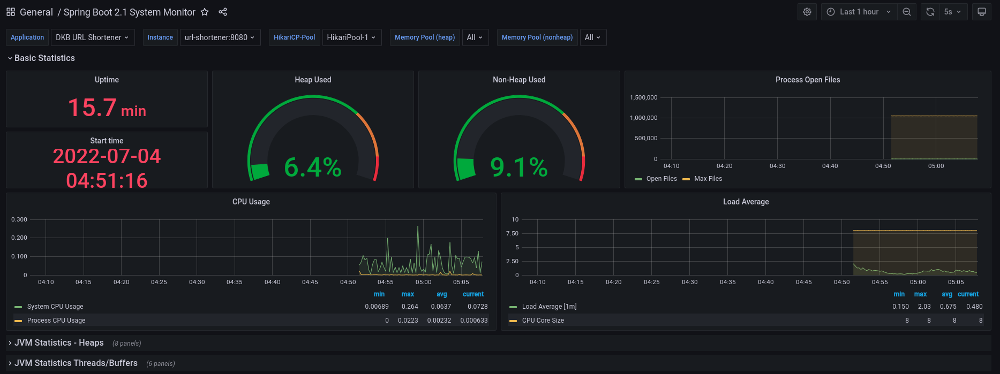
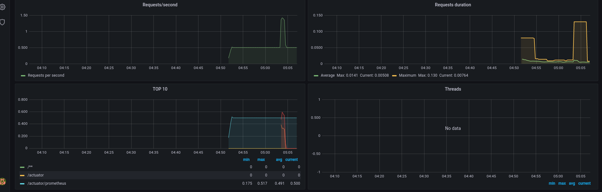

# Getting Started
***
### Overview

This service  takes a URL and returns a shortened URL, other way around of course, we should be
able to resolve the full URL. 

[](https://github.com/shanmugam-88/urlshortener/actions/workflows/maven.yml)

### Tech stack overview
* Kotlin
* spring-boot-starter-web (Spring boot framework V2.5)
* spring-boot-starter-data-jpa (for Sata persistence)
* spring-boot-starter-actuator (for API statistics)
* mysql (Database, It runs as a docker image)
* flyway (DB Migration)
* docker compose (Build and run the application)
* commons-validator:1.7 (for URL val validation)
* h2 (Test Database)
* spring-boot-starter-test 
* Swagger 3.0.0 (API documentation)
* [Hashids](https://hashids.org/) 1.0.3 (To generate the hash)
* Prometheus and Grafana (API Monitoring)

### Technical overview

* Docker compose start the application and Mysql. It uses the same network to run all our services.
* Flyway runs the initial DB script (migration script)
* We load the DB credentials from **.env** file, we can create a different env files based on our environment
* Please make sure the all required ports are free in the environment like 8080, 3306(mysql), 9090(Prometheus), 3000(Grafana)

### Non-Functional overview
* Grafana allows for the monitoring of application health, performance, and statistics.
* Application can be scaled up or down.

### Future Functional enhancement
* Duplicate URL check before creating the hash value
* Expiration date of URL


## Technical Design Diagram
***


## Installation
### Pre-requisites

- [Docker](https://docs.docker.com/engine/install/)
- [Docker Compose](https://docs.docker.com/compose/)

### Run the application
Run the below commands to start the application via docker

    docker-compose up --build

### How do we access the service?
We can access the application from the [swagger ui](http://localhost:8080/swagger-ui/index.html)

## Development
***
### Environment setup
For development, we need the following installed:
- [Docker](https://docs.docker.com/engine/install/)
- [Open jdk 11](https://openjdk.java.net/install/)
- [Maven 3](https://maven.apache.org/install.html)

### Build and run the app

To create the jar file

    mvn clean install

To run the test

    mvn test

### Test Data
***

1. Get Shorter URL a to-do.
   **Request**
   ```sh 
   curl -X POST "http://localhost:8080/shortener" -H "accept: */*" -H "Content-Type: application/json" -d "{ \"url\": \"https://www.dkbcodefactory.com\"}"
     ```

   **Response**
    ```sh
      lXB 
   ```
2. Invalid Url Test case.
   
   **Request**
   ```sh
      curl -X POST "http://localhost:8080/shortener" -H "accept: */*" -H "Content-Type: application/json" -d "{ \"url\": \"www.dkbcodefactory.com\"}"
   ```
   **Response**
    ```sh
        400 Status Code.
   
        Response Body 
        {
          "message": "Invalid Url"
        }
   ```
3. Get a full URL. The response status code is 302.(Our client should redirect it to actual URL)
   
   **Request**
   ```sh
    curl -X GET "http://localhost:8080/shortener/lXB" -H "accept: */*"
    ```
   
   **Response**
    
    We can see the proper redirection.

    

   
4. Invalid HashCode.
   **Request**
   ```sh
   curl -X GET "http://localhost:8080/shortener/lXB1" -H "accept: */*"
   ```

   **Response**
    ```sh
        404 Status Code. 
   ```

###Grafana Data and Dashboard configuration
***

#### Data configuration
* Login into [Grafana](http://localhost:3000/)
  
   Username: admin
   Password: admin
   
* Goto Data Source and add our Prometheus as data source
   
* Add Prometheus URL (http://prometheus:9090)
   
  
#### Dashboard configuration
We can add this [Spring Boot 2.1](https://grafana.com/grafana/dashboards/11378) System Monitor as our Dashboard.
* Click on import dashboard, Please [refer](https://grafana.com/docs/grafana/latest/dashboards/export-import/#import-dashboard) here.
* Enter this spring boot dashboard id - 11378, select prometheus data source and import it.
  
  
### Grafana Monitoring
***
* Once we set up the data and dashboard we can monitor our application like CUP usage, memory usage, request / response time.

   

   
